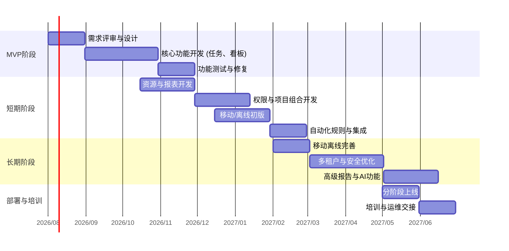

# 执行摘要  
本报告基于对国内外优秀项目管理系统的调研，从功能需求、非功能指标、系统架构、平台案例及实施计划等多维度进行分析。功能上，建议完善任务管理、里程碑、甘特图、看板、多项目组合、资源管理、权限与组织架构、仪表盘/报表、移动和离线支持、开放API/插件机制、国际化与多租户等要素，并参考市面主流产品（如 Jira、Wrike、PingCode、Worktile、Teambition、Zoho Projects 等）的优秀设计；非功能方面，建议明确可用性（SLA 约99.9% 以上）、恢复目标（RTO/RPO）、并发用户规模、响应时延目标、伸缩与容错策略、一致性保证、备份与安全合规措施等指标；架构上，推荐采用微服务/模块化设计、事件驱动和消息队列、数据库分片与缓存、多区域多可用区部署、容器化与K8s编排、持续集成/持续交付、以及完善的监控告警体系。基于以上分析，报告提出了需求修改与优先级建议（按MVP、短期、长期划分），并评估实现复杂度和潜在风险；制订了功能/性能验收标准（功能测试、性能测试、容灾演练、可用性监控等）；最后给出了迁移与实施分阶段计划，包括数据迁移、分批上线、回滚策略、培训与运维交接，并附甘特图时间线供参考。比较表格汇总了各功能与指标在参考厂商中的支持情况，以便快速对照。综合分析利弊，报告提出明确可执行的优化方案与下一步工作清单。

## 1. 功能需求清单  
项目管理系统应支持全面的项目及任务管理功能，参考行业主流产品包括：  

- **任务与子任务管理**：支持创建、分配、拆分子任务、设置优先级、截止日期等。如 PingCode 提供“自定义工作流、无限自定义字段和任务关联”【26†L212-L220】；Teambition 支持“任务分配、优先级标记、子任务分解”等细节管理【54†L15-L20】【55†L99-L102】。  
- **里程碑与依赖**：能够标记项目关键节点、设置任务依赖关系，并在甘特图或时间线中体现。Atlassian 指出甘特图“显示任务列表、开始和结束日期、里程碑、任务依赖关系及负责人”【69†L1681-L1684】，有助于规划与跟踪项目进度。  
- **甘特图（时间线视图）**：提供可交互的甘特图或时间线视图，直观展示任务和里程碑随时间的进度和依赖。如 Zoho Projects 强调“甘特图可规划项目、跟踪进度、直观查看依赖关系，并可按需重新调整任务”【57†L110-L118】。下图为 Jira 甘特图示例：  

  【73†embed_image】*图：Jira 中甘特图时间线视图示例。甘特图以可视化时间线方式展示任务和里程碑的起止时间与依赖关系【69†L1681-L1684】【57†L110-L118】。*  

- **看板视图**：提供看板（Kanban）视图，通过列和卡片可视化任务状态和流程。如 Jira 看板“通过显示与每个任务最相关的信息，让团队一目了然地了解工作进展”，并可配置工作流和 WIP 限制【10†L100-L108】【10†L104-L112】。下图为典型看板示例：  

  【67†embed_image】*图：典型 Kanban 看板示例（来源：Jira）。看板通过列状卡片展示任务状态，有助于团队直观管理工作流程【10†L100-L108】【10†L104-L112】。*  

- **资源管理与产能规划**：支持团队/成员的工作量统计、资源分配和平衡。PingCode 提供“项目资源与产能管理，帮助规划进度并跟踪团队工作量”【26†L78-L86】；Wrike 的高端版本提供“高级资源和产能规划，可设定角色、记录工时、制定预算”【81†L362-L370】，确保不超负荷并优化资源利用。  
- **权限与组织架构**：支持基于角色的访问控制(RBAC)和多层级组织结构设计。平台应能定义部门/项目组、权限角色和成员归属。例如， 通用做法是在多租户架构下引入“组织（Organization）”概念，每个租户或工作区对应一个组织实体，配合角色与权限体系实现细粒度控制【15†L113-L121】。  
- **多项目组合管理**：支持跨项目视图和项目集管理，比如项目组合（Program/Portfolio）视图，以统一监控多个项目进度和资源。如 PingCode 提供“项目集管理（Portfolio）：管理多个项目并协调资源”【26†L86-L94】；Zoho Projects 有“项目组合仪表板，在门户中展示各项目进度、状态和预算”【57†L154-L163】。  
- **报表与仪表盘**：内置或可配置的仪表盘与报表功能，为不同角色提供统计分析、关键指标（KPI）和可视化图表。Wrike 支持“自定义控制板、可视化报表和BI功能，实现实时可见性”【79†L362-L370】【81†L364-L372】；Teambition 支持“报表生成、图表展示，可定制关键数据维度”【54†L29-L34】。  
- **移动端与离线支持**：应提供 iOS/Android 等移动客户端，允许用户随时访问和更新项目数据。PingCode 明确指出支持“PC/iOS/Android 多端同步，随时随地移动办公”【26†L212-L220】。虽然在线访问优先，但建议考虑客户端缓存实现部分离线功能，如离线记录任务，恢复网络时同步。  
- **第三方集成/API**：开放 API 和集成能力，与协同工具（如邮件、即时通讯、版本控制等）或企业系统互联。Wrike 提供 Wrike Integrate 和 Wrike Sync，可无代码地与 Jira、GitHub、Slack、Salesforce 等应用双向同步【81†L332-L340】；Teambition 支持“API接口开放”，并能与钉钉、企业微信、Slack、Google Drive 等集成【54†L37-L40】【55†L74-L80】。  
- **插件/扩展机制**：支持插件或扩展开发机制，方便未来功能扩展。Atlassian 的 Marketplace 是成熟方案，国内产品如飞书/钉钉也提供插件平台（如飞书项目插件【28†L59-L62】）。系统应设计插件框架或模块化扩展点，允许第三方功能定制。  
- **国际化与多租户**：支持多语言界面和多组织/租户模式。系统界面、报告和通知应可进行本地化。多租户架构下，各租户应在逻辑上隔离（见权限组织）；如 Atlassian Cloud 的多租户模式，每个容器可承载多个租户数据，保证隔离安全【43†L432-L442】。

各功能在参考厂商中的支持情况如表1所示。  

| **功能/特性**         | **Jira (Atlassian)** | **PingCode**      | **Worktile**      | **Wrike**        | **Teambition/钉钉** | **Zoho Projects** |
|----------------------|---------------------|-------------------|-------------------|------------------|---------------------|-------------------|
| 任务管理             | √（支持任务、子任务、Issue）【23†L218-L227】 | √（支持任务分配、工作流）【26†L62-L70】 | √（支持任务、列表视图）【28†L118-L122】 | √（任务分解、资源分配）【40†L250-L258】 | √（任务分配、子任务）【54†L10-L13】 | √（任务分解、优先级）【57†L104-L112】 |
| 里程碑              | √（支持标记里程碑） | √（支持设定里程碑） | ✓（通过甘特图标记） | √（支持里程碑）    | √（支持里程碑）     | √（甘特图显示里程碑）【57†L110-L118】 |
| 甘特图               | △（Jira 需插件或高级版） | √（内置甘特图视图）【26†L62-L70】 | √（甘特图进度展示）【28†L144-L148】 | √（交互式甘特图）【40†L288-L292】 | √（提供时间线/Gantt视图）【54†L10-L13】 | √（内置甘特图视图）【57†L110-L118】 |
| 看板（Kanban）       | √（内置敏捷看板）【10†L100-L108】 | √（支持敏捷/看板）【26†L212-L220】 | √（拖拽式看板视图）【28†L118-L122】 | √（看板视图）【40†L254-L261】 | √（看板视图）【54†L10-L13】 | √（看板视图）【57†L104-L112】 |
| 资源管理（工时/负载）| △（需插件）       | √（产能规划、负载视图）【26†L78-L86】 | ✕（无专用资源模块） | √（负载视图、高级规划）【79†L362-L370】 | ✕                 | √（工时和负载管理）【57†L154-L163】 |
| 权限/组织架构       | √（细粒度权限、项目/组划分） | √（团队和权限） | √（支持团队权限） | √（角色/权限管理） | √（组织与权限管理） | √（角色与多项目支持） |
| 多项目组合/项目集    | √（Portfolio 高级版） | √（项目集管理）【26†L86-L94】 | ✕                 | √（可视化组合视图） | √（项目监控视图）【52†L1-L6】 | √（组合仪表板）【57†L154-L163】 |
| 仪表盘/报表          | √（可配置Dashboard） | √（数据统计报表）【54†L29-L34】 | ✓（统计报表）     | √（自定义报表与BI）【81†L364-L372】 | √（报表生成）【54†L29-L34】 | √（图表报表）【57†L154-L163】 |
| 移动端               | √（支持 iOS/Android） | √（PC/iOS/Android同步）【26†L212-L220】 | √（iOS/Android 应用）【79†L246-L254】 | √（Web/桌面/移动）【79†L246-L254】 | √（钉钉移动端） | √（移动应用） |
| 离线支持             | ✕                 | △（部分离线录入） | ✕                 | ✕                | ✕                 | ✕                |
| 第三方集成/API       | √（丰富 REST API, Apps） | √（开放API，CI/CD）【26†L212-L220】 | √（开放平台，支持 API） | √（Wrike Integrate/Sync）【81†L332-L340】 | √（支持钉钉/微信等集成）【54†L37-L40】 | √（丰富集成，Zoho 生态） |
| 插件/扩展机制       | √（Marketplace生态） | △（支持插件定制） | √（开放平台）   | √（Wrike Integrate）【81†L332-L340】 | √（钉钉/飞书插件平台） | √（Zoho Marketplace） |
| 国际化              | √（多语言支持）      | √（支持中英文） | √（多语言）      | √（多语言）     | √（中文支持）      | √（多语言）     |
| 多租户              | √（云产品多租户架构）【43†L432-L442】 | ✕（未指明）    | ✕（未指明）    | ✕（租户隔离）      | ✕（工作区独立）    | ✕（未指明）    |  

## 2. 非功能需求与量化指标  
针对高可用、高性能的系统要求，需要明确关键指标：  

- **可用性SLA**：建议目标≥99.9%。参考行业云服务，多可用区部署是基本保证。Atlassian 在云架构中采用多可用区，RDS数据库多区同步，AZ故障自动切换（故障时间60-120秒）【43†L332-L340】【43†L342-L349】。Wrike 承诺“99.9% 正常运行时间”并持续备份【79†L191-L194】。系统设计上应利用负载均衡、多AZ/多Region部署和自动故障转移来满足 SLA 要求。  
- **恢复时间目标 RTO/RPO**：建议 RTO 控制在数分钟内，RPO（数据丢失量）尽量低（如几分钟级别）。Atlassian 云采用自动快照，RPO = 1 天（快照保留30天）【43†L369-L378】；数据库主备切换耗时 1-2 分钟【43†L342-L349】。系统应支持自动备份与快速恢复，至少每日快照并定期演练恢复流程。  
- **并发用户数与吞吐量**：应根据目标用户规模评估资源，设计横向扩展能力。大型 SaaS 产品通常支持数万级并发用户；建议在架构层面预留自动伸缩机制。可借鉴微服务与分库分片，使各服务水平扩展。  
- **响应时延**：界面交互应尽量保持秒级响应，如常规操作<200ms，复杂查询<1s。可以通过缓存策略（如使用 Redis 缓存热点数据【76†L1-L4】）、前端异步加载等方式优化。  
- **扩展策略**：采用云原生弹性扩展，如基于 Kubernetes 的自动弹性伸缩（Pod/HPA）与数据库分片。阿里云推荐“Kubernetes集群支持微服务实践，可任意选择框架技术”【45†L25-L33】；负载均衡（如阿里云SLB）可将流量分发至多实例，消除单点故障【45†L49-L52】。  
- **容错与降级**：系统各层采用多实例冗余部署，前端采用多活负载均衡，中间层微服务独立部署。利用消息队列异步处理避免同步阻塞。设计服务降级策略（如服务熔断、静态缓存应答等），保证在部分模块异常时仍能提供核心功能。  
- **数据一致性**：对于任务/进度等核心业务，可采用强一致方案（如使用关系型数据库和事务）。但对于日志、缓存等可采用最终一致；消息队列保证至少一次送达【64†L1-L4】。  
- **备份与恢复**：至少每日全量备份、实时增量备份，并定期进行恢复演练。数据库可采用云厂商 RDS 自动备份功能；关键配置/代码也要纳入版本管理和备份。  
- **安全合规**：参考行业合规要求（如 ISO27001、ISO27017、SOC2、GDPR 等）。数据传输加密（HTTPS/TLS），敏感数据加密存储（数据库透明加密或自持钥匙）。Wrike 提到“基于角色访问控制”和独立加密中心【79†L189-L194】；可考虑类似方案。严格的权限审计、日志审计和定期安全扫描是必要的。

## 3. 架构模式与技术选型建议  
为满足高可用、高可扩展需求，推荐采用现代云原生架构：  

- **微服务/模块化**：将项目管理系统拆分为若干服务模块（如任务服务、用户服务、报告服务等），各模块独立部署升级。阿里云强调：“Kubernetes集群为微服务提供良好支持，将单体拆分为多个微服务，驱动敏捷开发，技术选型更加自由”【45†L25-L33】。微服务可按领域划分，避免单点故障、降低耦合。  
- **容器化与Kubernetes**：所有服务采用 Docker 容器化部署，利用 Kubernetes 进行编排、自动伸缩和滚动升级。Atlassian 在云平台中使用 K8s 或内部 PaaS 平台（Micros）部署容器化服务【43†L415-L424】。这样可快速扩容，容错性好。  
- **事件驱动与消息队列**：采用 Kafka、RabbitMQ 等消息队列进行异步通信。事件驱动架构通过事件总线解耦服务，提高系统吞吐能力。Google 指出：“高可扩展性和可用的消息传递服务通常通过多个处理系统确保消息至少传送一次。事件驱动架构可容忍重复消息”【64†L1-L4】。例如，任务状态变更可发布事件，由通知服务或统计服务异步消费，避免前端请求阻塞。  
- **数据库分片/多模**：对于大规模项目数据，可横向分库分表，或使用多活集群。考虑多数据库结合：关系型数据库（如 MySQL、PostgreSQL）用于核心事务；NoSQL（如 MongoDB）用于灵活存储多维度报表或日志；搜索服务（Elasticsearch）用于全文检索。按需分片或多实例部署，以分担压力。  
- **缓存策略**：大量读操作可使用 Redis 等内存缓存。Redis 是“快速的内存数据库……消除对关系型数据库的查询，显著加快响应速度”【76†L1-L4】。建议关键查询结果（如常用统计、图表数据）缓存，结合合理的 TTL 与失效策略。  
- **负载均衡与多AZ部署**：应用层（包括 API 网关）前端均使用云负载均衡。后端服务多副本部署于不同可用区，实现多活。数据库使用主备复制，多AZ节点实现自动故障切换【43†L342-L349】。这样单AZ故障时系统仍可用。  
- **CI/CD 流水线**：使用 GitLab CI、Jenkins、ArgoCD 等实现持续集成/持续交付。代码、配置和数据库变更通过审批流程自动化部署，缩短交付周期。采用蓝绿部署或滚动更新，降低发布风险。  
- **监控与告警**：构建完善的监控体系（Prometheus + Grafana 监控指标、ELK/EFK 日志分析、Tracing 链路追踪）。关键指标（请求耗时、错误率、系统负载等）应设定阈值自动告警。容灾演练中验证监控有效性。  

## 4. 优秀厂商案例分析  
调研至少五款国内外项目管理产品，提炼其优势和可借鉴点：  

- **Atlassian Jira (国际)**：成熟的敏捷项目管理平台，支持 Scrum/Kanban、灵活的工作流和丰富的自定义字段【23†L218-L227】。优势在于大规模用户基础、可扩展生态（Marketplace 插件上千）以及严格的权限控制体系；缺点是不内置甘特图（需高级版或插件）、原生资源管理较弱。Jira UI 的看板、报告页面较简洁实用；其云架构采用微服务+Kubernetes，多租户且数据隔离【43†L415-L424】【43†L432-L442】。可借鉴其**审批工作流定义方式**、多语言支持和产品组件化策略。  
- **Wrike (美国)**：面向企业级用户，特点是功能全面且可高度自定义。提供交互式甘特图【40†L288-L292】、负载视图、仪表盘和 BI 报表【81†L362-L370】。支持移动端、内置人工智能助手、并强调安全合规（角色权限管理、数据加密）【79†L189-L194】。Wrike 推出 Wrike Integrate/Sync 实现与外部系统无代码集成【81†L332-L340】。其架构强调高可用（99.9% SLA）【79†L191-L194】。可借鉴其**视觉仪表盘设计**（如多项目看板和BI报表）以及**自动化集成平台**思路。  
- **PingCode (国内)**：专注研发管理，功能覆盖任务、看板、甘特及项目组合等【26†L62-L70】【26†L78-L86】。特色是支持“基线 vs 实际进度”对比、项目集管理与移动多端同步【26†L62-L70】【26†L212-L220】。UI 风格现代简洁，操作灵活。架构细节未披露，但现有能力表明其支持敏捷和瀑布混合开发模式【26†L138-L147】。可借鉴其**项目基线管理**、**移动端全功能同步**等设计。  
- **Worktile (国内)**：全功能管理工具，支持看板、甘特、列表等多视图【28†L118-L122】【28†L144-L148】。突出点在于强大的自定义工作流程和模板管理，适合复杂业务场景。界面简洁直观，移动端亦有支持。缺点可能在于对报表与资源规划功能支持一般。Worktile 开放平台允许企业深度定制。可参考其**多视图协作界面**和**模板化项目设置**。  
- **Teambition (钉钉) (国内)**：阿里巴巴团队协作产品，功能涵盖任务、看板、甘特、里程碑【54†L10-L13】。优势是与钉钉/飞书深度集成、界面本地化良好、企业微信无缝接入。支持自动化规则和开放API【54†L37-L40】。Teambition 强调团队协同（评论、@ 提及、实时推送）【54†L22-L27】。可借鉴其**轻量级自动化规则**和**即时消息通知**设计。  
- **Zoho Projects (国际)**：功能完备的 SaaS 平台，支持任务分解、甘特、看板、资源管理和多级报表【57†L104-L112】【57†L154-L163】。界面友好，内置了多个视图模式和自定义字段【57†L168-L176】。其架构服务全球用户，多数据中心部署。Zoho 生态提供丰富集成。可借鉴其**多种任务视图切换**和**自定义界面配置**能力。

## 5. 需求修改建议与优先级  
基于调研结果和业务需求，建议按 **MVP、短期、长期** 三个阶段迭代开发，并给出实现复杂度和风险：  

- **MVP (核心功能)**：  
  - **任务、看板、基本甘特**：快速完成任务创建、编辑、看板视图，以及简单甘特图（可只读或编辑）【10†L100-L108】【69†L1681-L1684】。（复杂度中等，风险低）  
  - **用户/组织与权限基础**：实现基本的项目/组织结构和角色权限功能，确保项目隔离与安全。（复杂度较高，需要设计好数据模型，风险中）  
  - **单项目报表仪表板**：提供项目级进度看板和简单统计（如完成率、工时总览）。（复杂度中等）  
  - **移动端支持**：推出移动端 App，同步核心功能。（难度高，需多平台开发）  
  - **API基础**：开放基础 REST API，支持任务、项目等实体的增删改查。  
  这些需求应优先实现，以便尽快上线验证核心价值。复杂度评估：任务&看板开发常规，权限与多组织设计难度较大。  
- **短期迭代**：  
  - **项目组合与高级看板**：实现多项目组合视图（项目集管理）、里程碑视图和多维看板（跨项目）。  
  - **资源与工时管理**：添加团队成员负载视图、工时统计和基础预算模块【81†L362-L370】。  
  - **仪表盘与自定义报表**：丰富仪表盘（可拖拽组件），增加自定义报表指标。  
  - **离线功能**：增量实现离线录入（缓存模式）并后台同步。  
  - **插件/自动化**：提供简单的规则引擎或 Webhook，允许设置任务自动流转规则。【54†L37-L40】  
  - **国际化**：完善多语言支持（界面翻译、时区处理）。  
  实现复杂度中高，需跨团队协作，风险包括数据一致性处理难度和移动离线同步稳定性。  
- **长期规划**：  
  - **第三方深度集成**：与企业办公套件（邮件、IM）、版本控制、CI/CD 等打通【81†L332-L340】。  
  - **插件/扩展平台**：开发插件框架或市场，支持自定义扩展功能。  
  - **多租户优化**：如系统对外提供服务，应加强租户隔离、配额管理、计费系统等。  
  - **高级功能**：如 AI 助手、智能排期优化、移动端离线功能完善。  
  长期工作量大，需要持续投入。风险点包括架构迭代成本和与第三方系统兼容性问题。  

每项功能可按 MVP/短期/长期划分表述，具体工作量需项目团队与架构师评估后定量。  

## 6. 验收与测试标准  
- **功能测试**：覆盖所有功能场景，包括任务管理流程、权限验证、各视图交互、数据统计等。使用自动化测试脚本（单元+集成）保证核心业务逻辑正确。  
- **性能测试**：根据并发用户目标（例如10k用户在线），进行负载测试。关注关键接口（任务查询、更新）响应时延和系统吞吐。压测指标可参考 <200ms 的请求延时。  
- **容灾演练**：定期模拟故障场景（单机/单AZ宕机、网络中断等），验证自动切换与降级策略是否有效，确保服务可在预期RTO内恢复。  
- **可用性监控**：部署多层监控指标：应用级（请求失败率、事务耗时）、系统级（CPU/内存负载）、业务级（每天活跃项目数等）。设置告警（如错误率突增即报警），保证运维可以及时响应。  
- **安全测试**：进行渗透测试、代码扫描，验证权限控制、数据加密、输入校验等安全机制。确保合规需求得到满足。  

## 7. 迁移与实施计划建议  
- **数据迁移**：制定数据迁移方案（从旧系统或Excel导入）。设计数据映射表，对导入过程进行校验。迁移时分批验证，确保无数据丢失。  
- **分阶段上线**：采用灰度发布或分批用户试用。先在内部或小范围项目中验证新系统，再逐步扩大。每阶段结束后回顾调整。  
- **回滚策略**：保留旧系统并同步关键数据；新系统重大故障时可回退至旧系统。同时记录变更点，确保回滚脚本准确无误。  
- **培训与交接**：上线前后进行用户培训，编制操作手册。对运维/客服团队进行知识交接，说明系统架构、监控方式及应急流程。  
- **上线后支持**：安排开发和运维团队在上线初期提供加班支持，及时解决问题。建立反馈机制，收集用户意见持续改进。  

以上甘特图为分阶段实施计划示意（任务时间线仅供参考）。  

**下一步行动清单**：基于以上分析，建议立即组织需求评审，细化功能优先级和里程碑；成立专项小组负责架构设计和技术选型论证；制定详细开发计划并同步资源（人力、硬件、外部集成对接等）；预研关键技术（微服务框架、队列组件、DB选型等）；启动样板项目/原型开发验证关键功能，并提前准备测试方案及环境。通过持续迭代和监控保障，本项目将有效提升系统的高可用、可扩展性和灵活性。

**参考资料**：以上分析引述自官方文档及权威资料【10†L100-L108】【26†L62-L70】【43†L332-L340】【54†L10-L18】【79†L191-L194】【76†L1-L4】等。具体建议以实际情况调整。